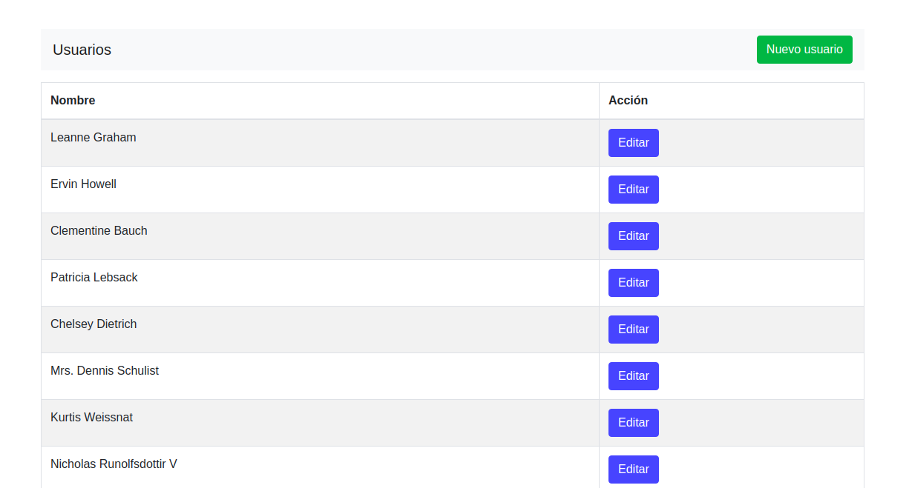
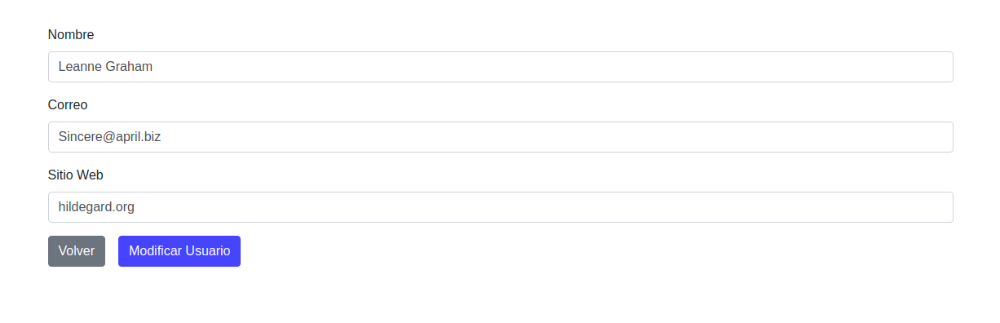

## ReactJS - Administrador de Usuarios
Este es un ejemplo de una app básica construida en ReactJS, donde se desarrolló un mantenedor de usuarios.

### Lista de Usuarios

### Modificar Usuarios

## Ejecutar el proyecto

Dentro del directorio del proyecto debes ejecutar lo siguiente:

### `yarn start`

Runs the app in the development mode. 
Luego abre el navegador con las siguietes URLs [http://localhost:3000](http://localhost:3000).

